## 📑 Table of Contents

- About
- Repository Goals
- Highlights
- Technologies
- Learning Modules
- Repository Workflow
- Folder Structure
- Timeline
- Diagrams
- Getting Started
- Topics Covered
- Features
- Contributing
- License

<div align="center">

# 🐍 Python Programming Repository

### **A Complete Python Learning Repository From Basics to Advanced, DSA, OOP, Automation & Real Projects**


<br>


</div>

---

# 📖 About This Repository

Welcome to my **Python Programming Repository**.

This repository is a complete collection of everything I have learned while studying Python—from the absolute basics to advanced concepts, including Data Structures & Algorithms, Object-Oriented Programming, Automation, File Handling, Mini Projects, and Real-World Applications.

Instead of uploading only final projects, I have documented my complete learning journey with practice programs, exercises, notes, and project implementations.

The goal of this repository is to create a well-organized Python knowledge base that anyone can use for learning, revision, and interview preparation.

---

# 🎯 Repository Goals

- Learn Python from Beginner to Advanced
- Build Strong Programming Logic
- Practice Problem Solving
- Master Object-Oriented Programming
- Learn File Handling
- Understand Exception Handling
- Practice Data Structures & Algorithms
- Build Automation Scripts
- Create Mini Projects
- Develop Real World Applications
- Improve Coding Skills
- Prepare for Technical Interviews

---

# ✨ Repository Highlights

✅ Beginner Friendly

✅ Hundreds of Python Programs

✅ Mini Projects

✅ Automation Scripts

✅ File Handling Examples

✅ OOP Concepts

✅ DSA Implementations

✅ Interview Practice

✅ Well Organized Folder Structure

✅ Continuous Updates

---

# 🛠 Technologies Used

| Category | Technologies |
|----------|--------------|
| Programming Language | Python |
| IDE | VS Code |
| Version Control | Git |
| Repository Hosting | GitHub |
| Operating System | Windows |
| Package Manager | pip |

---

# 📚 Learning Modules

| Module | Status |
|---------|--------|
| Python Basics | ✅ |
| Variables | ✅ |
| Data Types | ✅ |
| Operators | ✅ |
| Conditional Statements | ✅ |
| Loops | ✅ |
| Functions | ✅ |
| Strings | ✅ |
| Lists | ✅ |
| Tuples | ✅ |
| Dictionaries | ✅ |
| Sets | ✅ |
| File Handling | ✅ |
| Exception Handling | ✅ |
| OOP | ✅ |
| Modules | ✅ |
| Advanced Python | ✅ |
| Automation | ✅ |
| DSA in Python | ✅ |
| Mini Projects | ✅ |

---

# 🚀 Repository Workflow

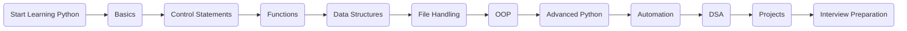

---

# 🧠 Python Learning Mindmap

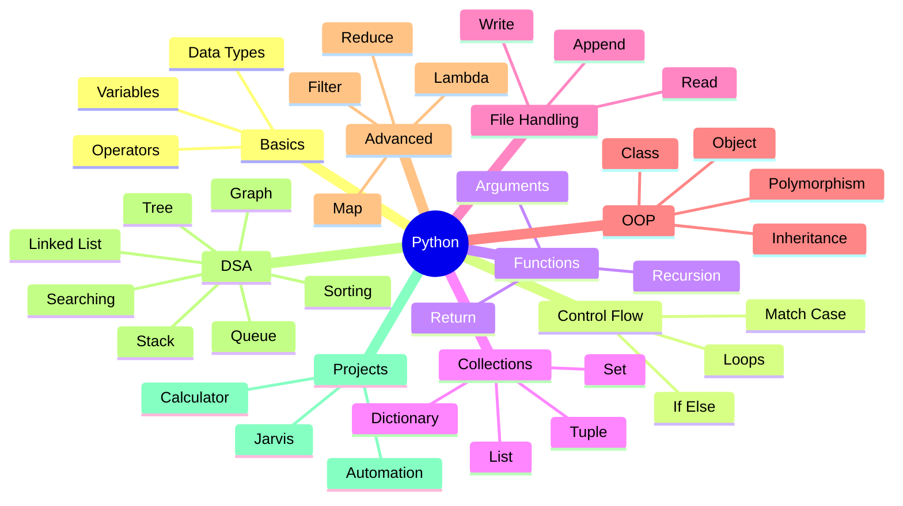

---

# 📌 Repository Structure

```text
Python/
│
├── Python Basics
├── Practice Programs
├── Loops
├── Functions
├── Strings
├── Lists
├── Tuples
├── Dictionaries
├── Sets
├── File Handling
├── Exception Handling
├── OOP
├── Advanced Python
├── DSA in Python
├── Mini Projects
├── Automation Scripts
└── README.md
```

---

## ⭐ If you find this repository helpful, don't forget to Star it!

---

# 📂 Folder Description

| Folder | Description |
|---------|-------------|
| **python/** | Beginner level Python programs |
| **chapter 2/** | Variables, Data Types, Strings |
| **condition.py/** | If-Else & Match Case Programs |
| **loops/** | While Loop, For Loop & Loop Practice |
| **functions/** | Functions, Arguments & Recursion |
| **dict and set/** | Dictionary & Set Concepts |
| **file_input_output/** | File Handling Examples |
| **oops/** | Object-Oriented Programming |
| **oops_ps/** | OOP Practice Questions |
| **advance python/** | Advanced Python Concepts |
| **advancde_python2.py/** | Functional Programming, Lambda, Map, Filter, Reduce |
| **dsa in python/** | Data Structures & Algorithms |
| **leetcode.py/** | LeetCode Solutions |
| **projects/** | Mini Python Projects |
| **mega_project/** | Large Real World Projects |

---

# 📅 Python Learning Timeline

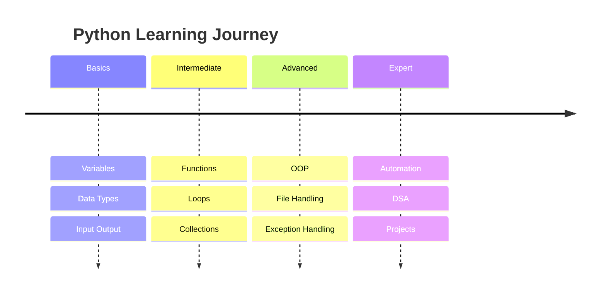

---

# 🌳 Python Development Journey

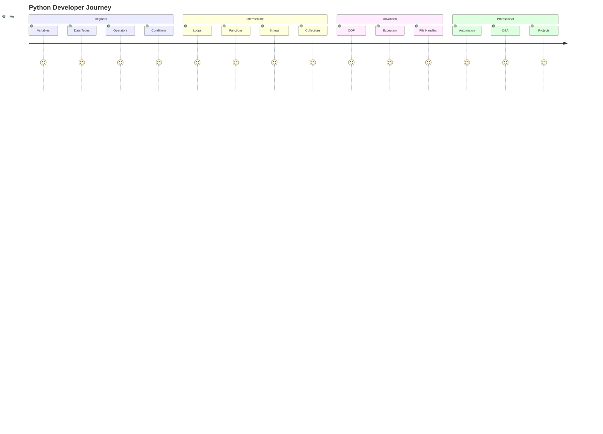

---

# 🔀 Repository Git Flow

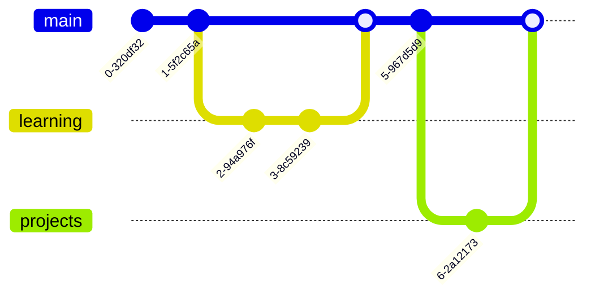

---

# 🔄 Program Execution Flow

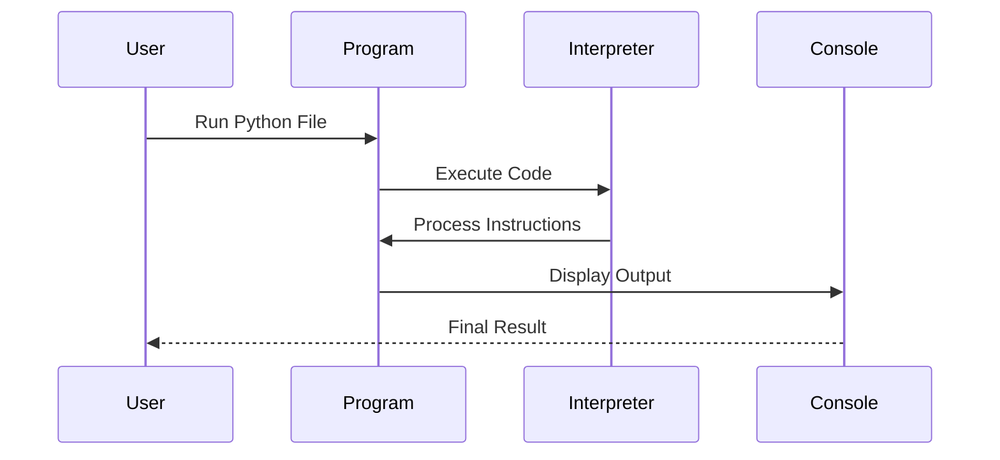

---

# 🧩 Object-Oriented Programming Structure

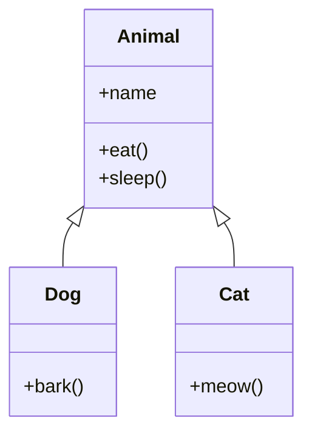

---

# 🗂 Data Relationship

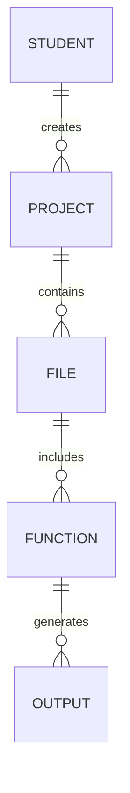

---

# ⚙ Python Program State Flow

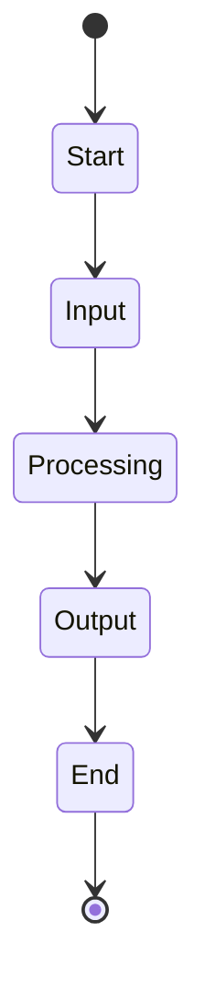

---

# 📋 Repository Completion Status

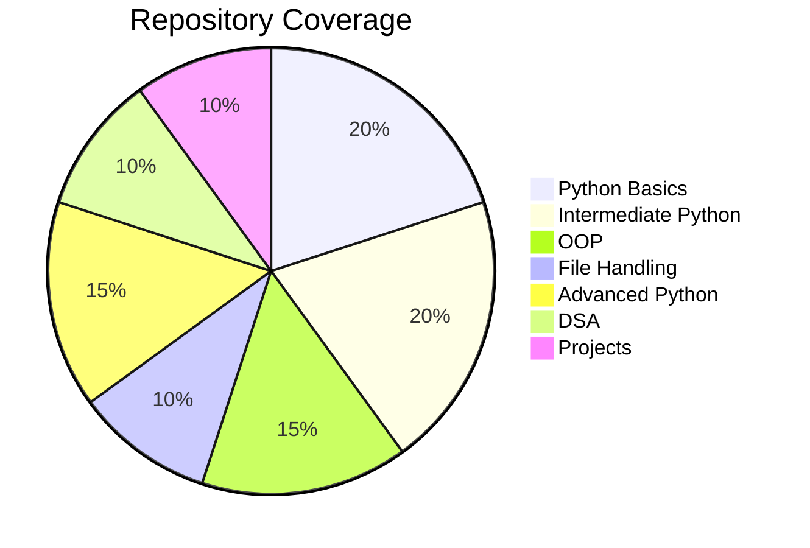

---

# 📆 Learning Schedule

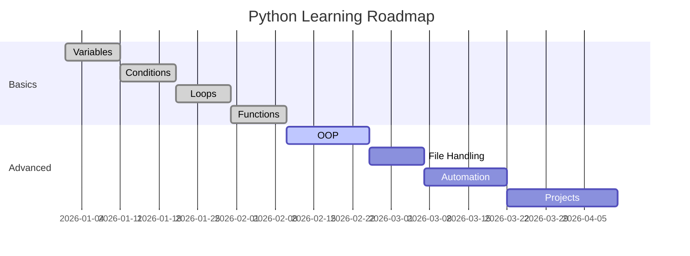

---

# 📑 Repository Requirements

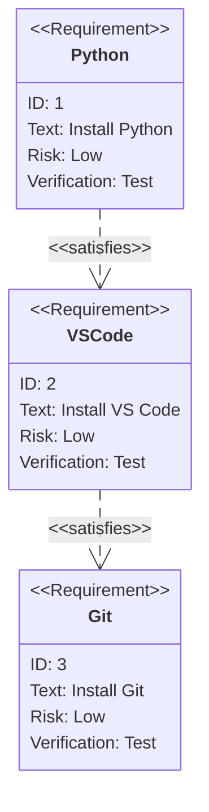
---

# 🎯 Learning Priorities

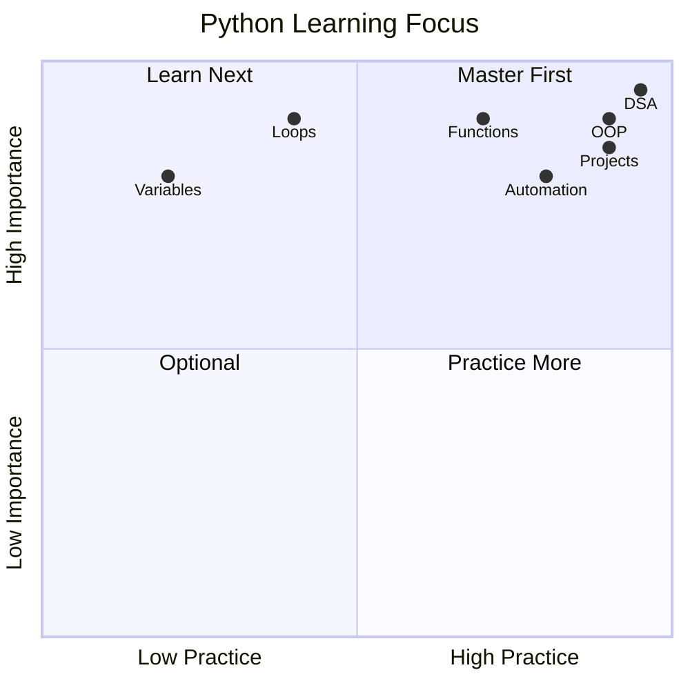

---

# 📖 Documentation Standards

- ✅ Clean Folder Structure
- ✅ Meaningful File Names
- ✅ Beginner Friendly Code
- ✅ Practice Questions Included
- ✅ Mini Projects
- ✅ DSA Implementations
- ✅ Object-Oriented Programming
- ✅ Automation Scripts
- ✅ Continuous Learning
- ✅ Regular Repository Updates

---

# ⚡ Getting Started

Follow these steps to run this repository on your local machine.

## 1️⃣ Clone the Repository

```bash
git clone https://github.com/nitinsharma9266/Python.git
```

---

## 2️⃣ Open the Repository

```bash
cd Python
```

---

## 3️⃣ Run Any Python Program

```bash
python filename.py
```

or

```bash
python3 filename.py
```

---

# 💻 System Requirements

| Requirement | Version |
|-------------|----------|
| Python | 3.10+ |
| Git | Latest |
| VS Code | Recommended |
| Operating System | Windows / Linux / macOS |

---

# 📦 Recommended VS Code Extensions

- Python
- Pylance
- Code Runner
- Error Lens
- Better Comments
- GitLens
- Material Icon Theme

---

# 📚 Topics Covered

### 🟢 Python Fundamentals

- Variables
- Data Types
- Input & Output
- Operators
- Strings
- Conditional Statements
- Loops
- Functions

---

### 🔵 Intermediate Python

- Lists
- Tuples
- Sets
- Dictionaries
- File Handling
- Exception Handling
- Modules
- Packages

---

### 🟣 Advanced Python

- Object-Oriented Programming
- Inheritance
- Polymorphism
- Encapsulation
- Abstraction
- Lambda Functions
- Map
- Filter
- Reduce
- Decorators
- Generators

---

### 🔴 DSA in Python

- Arrays
- Searching
- Sorting
- Stack
- Queue
- Linked List
- Trees
- Graphs
- Recursion

---

### 🟡 Projects

- Calculator
- Student Management System
- Bank Management System
- Jarvis Assistant
- Automation Scripts
- Mini Python Projects

---

# 🎯 Learning Objectives

After completing this repository, you should be able to:

- ✅ Write clean Python code
- ✅ Solve programming problems
- ✅ Understand Object-Oriented Programming
- ✅ Work with files
- ✅ Handle exceptions
- ✅ Build mini projects
- ✅ Understand DSA fundamentals
- ✅ Automate repetitive tasks
- ✅ Prepare for coding interviews

---

# 🌟 Repository Features

- 📂 Well Organized Structure
- 🧹 Clean Code
- 💬 Beginner Friendly
- 📝 Easy to Understand
- 💡 Real Examples
- 🎯 Interview Focused
- 🚀 Continuously Updated
- 📖 Self Learning Friendly

---

# 🤝 Contributing

Contributions are always welcome!

If you would like to improve this repository:

1. Fork the repository
2. Create a new branch

```bash
git checkout -b feature-name
```

3. Commit your changes

```bash
git commit -m "Add new feature"
```

4. Push your branch

```bash
git push origin feature-name
```

5. Open a Pull Request

---

# 📌 Repository Rules

- Keep the code clean.
- Follow Python naming conventions.
- Add comments where necessary.
- Maintain folder structure.
- Test code before committing.

---

# 🚀 Future Improvements

- More DSA Questions
- Advanced Projects
- GUI Applications
- Web Scraping
- APIs
- Machine Learning Basics
- Data Analysis
- Flask Projects
- Django Projects
- Automation Projects
- Testing Examples

---

# ⭐ Support

If this repository helped you:

⭐ Star the repository

🍴 Fork the repository

📢 Share it with other learners

---

# 📜 License

This repository is available under the **MIT License**.

Feel free to learn, explore, modify, and build upon the code.

---

# 🙏 Acknowledgements

Special thanks to:

- Python Community
- Open Source Contributors
- GitHub
- VS Code Team

for providing amazing tools and learning resources.

---

<div align="center">

# 🚀 Happy Coding!

### Keep Learning • Keep Building • Keep Growing

Made with ❤️ using Python

⭐ If you found this repository helpful, don't forget to Star it.

</div>